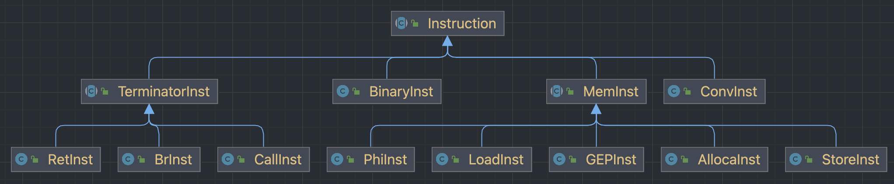

# 代码生成设计

## 代码生成综述

代码生成，我使用的是 LLVM IR 作为中间代码，最后将 LLVM IR 转换成 MIPS 汇编。主要是考虑到软院前几届的实验都是使用的 LLVM IR，有一套教程体系可以参考，在我生成 LLVM IR 中间代码的过程中，有很多地方都参考了软院之前的教程。

软院的 LLVM IR 教程是循序渐进的，先从最基本的 `main` 开始，一步一步往上添加功能，最后生成可以运行的 LLVM IR 代码。

教程链接如下：[miniSysY 编译实验](https://buaa-se-compiling.github.io/miniSysY-tutorial)


## LLVM IR 的结构

关于 LLVM IR 的结构，也是在软院的教程上学来的，链接地址：[LLVM IR 的结构](https://buaa-se-compiling.github.io/miniSysY-tutorial/pre/llvm_ir_quick_primer.html)


讲道理，感觉 LLVM IR 的结构完全不需要我来介绍，但是还是可以说两句。

### 总体结构

1. LLVM IR 文件的基本单位称为 `module`（本实验中涉及到的部分均为单 `module`，因为本实验只涉及到单文件编译）
2. 一个 `module` 中可以拥有多个顶层实体，比如 `function` 和 `global variable`
3. 一个 `function define` 中至少有一个 `basicblock`
4. 每个 `basicblock`中有若干 `instruction`，并且都以 `terminator instruction` 结尾

表现在代码里的感觉应该是这样：

```java
public class IRModule {
    private static final IRModule module = new IRModule();
    private List<GlobalVar> globalVars;
    private IList<Function, IRModule> functions;
    private HashMap<Integer, Instruction> instructions;

    private IRModule() {
        this.globalVars = new ArrayList<>();
        this.functions = new IList<>(this);
        this.instructions = new HashMap<>();
    }
  
    public static IRModule getInstance() {
        return module;
    }
}
```

`IList<N, L>`是我自己添加的一种结构，本质就是一个可以用`for`遍历的链表，其中整条链表的类型是`L`，链表里面存的元素的类是`N`。使用这种结构可以方便地对元素之间的位置关系作出调整。

### 函数定义与声明

定义就是`define`，声明就是`declare`。具体语法看示例就可以了。

> **对于 IO 的说明**
>
> 评测机提供了以下函数用于 IO，请在输出的 LLVM IR 头部显式声明这些函数（没有实际使用的函数可以不声明）：
>
> ```llvm
> declare i32 @getint()       ; 读取一个整数
> declare void @putint(i32)   ; 输出一个整数
> declare void @putch(i32)    ; 输出一个字符
> declare void @putstr(i8*)   ; 输出字符串
> ```
>
> 测试时，首先用 C 语言实现上述四个函数，然后用以下命令编译为 LLVM 链接库（假设 C 语言实现文件为 `lib.c` ）
>
> ```shell
> clang -emit-llvm -S -o lib.ll lib.c
> ```
>
> 将输出的 `llvm_ir.txt` 与上一步编译好的链接库 `lib.ll` 放置于同一目录下，用以下命令链接并解释执行 IR ：
>
> ```shell
> llvm-link -S -o run.ll llvm_ir.txt lib.ll
> lli run.ll
> ```
>
> 评测机提供的 IO 函数同时支持字符串输出和单个字符输出（分别对应 MARS 的 4 号和 11 号 syscall），可以自行选择输出方式（选取一种或混合使用均可），具体用法参见样例。如果选用字符串方式输出，可参考 [字符串常量的表示](https://llvm.org/docs/LangRef.html#complex-constants) 与 [getelementptr 指令](https://llvm.org/docs/LangRef.html#getelementptr-instruction) 。
>
> 例如`testfile.txt`
>
> ```c
> int main() {
>     int res;
>     res = getint();
>     printf("res = %d\n", res);
>     return 0;
> }
> ```
>
> 如果使用单个字符输出：
>
> ```llvm
> declare i32 @getint()
> declare void @putint(i32)
> declare void @putch(i32)
> define i32 @main() {
>     %1 = call i32 @getint()
>     call void @putch(i32 114)   ; 'r'
>     call void @putch(i32 101)   ; 'e'
>     call void @putch(i32 115)   ; 's'
>     call void @putch(i32 32)    ; ' '
>     call void @putch(i32 61)    ; '='
>     call void @putch(i32 32)    ; ' '
>     call void @putint(i32 %1)
>     call void @putch(i32 10)    ; '\n'
>     ret i32 0
> }
> ```
>
> 如果使用字符串输出：
>
> ```llvm
> declare i32 @getint()
> declare void @putint(i32)
> declare void @putstr(i8*)
> @_str_1 = constant [7 x i8] c"res = \00"
> @_str_2 = constant [2 x i8] c"\0a\00" 
> define i32 @main() {
>     %1 = call i32 @getint()
>     %2 = getelementptr inbounds [7 x i8], [7 x i8]* @_str_1, i32 0, i32 0
>     call void @putstr(i8* %2)
>     call void @putint(i32 %1)
>     %3 = getelementptr inbounds [2 x i8], [2 x i8]* @_str_2, i32 0, i32 0
>     call void @putstr(i8* %3)
>     ret i32 0
> }
> ```

### 基本块（Basic Block）

- 基本块中的代码是连续的语句序列
- 程序的执行(控制流)只能从基本块的第一条语句进入
- 程序的执行只能从基本块的最后一条语句离开

形象地讲，一个基本块中的代码是顺序执行的，且顺序执行的代码都属于一个基本块。

例如你有一份不含跳转（没有分支、循环）也没有函数调用的、只会顺序执行的代码，那么这份代码只有一个基本块。

### 指令（Instruction）

指令指的是 LLVM IR 中的非分支指令（non-branching Instruction），通常用来进行某种计算或者是访存（比如上面例子中的 `add`、`load`），这些指令并不会改变程序的控制流。

值得一提的是，`call` 指令也是非分支指令，因为在使用 `call` 调用函数时，我们并不关系被调用函数内部的具体情况（即使被调用函数内部存在的控制流），而是只关心我们传入的参数以及被调用函数的返回值，因此这并不会影响我们当前程序的控制流。

### 终结指令（Terminator instruction）

终结指令**一定**位于某个基本块的末尾（否则中间就改变了基本块内的控制流）；反过来，每个基本块的末尾也**一定**是一条终结指令（否则仍然是顺序执行的，基本块不应该结束）。终结指令决定了程序控制流的执行方向。例如，`ret` 指令会使程序的控制流返回到当前函数的调用者（可以理解为 `return`），`br` 指令表示根据标识符选择一个控制流的方向（可以理解为 `if`）。

## 一切皆 `Value`

这是个夸张的说法，不过在 LLVM 架构中，的确几乎所有的东西都是一个 `Value`，这里有张继承关系图。


- `BasicBlock`，`Argument`，`User` 都继承了 `Value` 类
- `Constant` 和 `Instruction` 继承了 `User`
- 图中没有 `Function` 类，但实际上 `Function` 类通过多重继承继承了 `Constant` 类，所以 `Function` 也是 `Value` 和 `User`

`Value` 是一个非常基础的基类，一个继承于 `Value` 的子类表示它的结果可以被其他地方使用。 一个继承于 `User` 的类表示它会使用一个或多个 `Value` 对象根据 `Value` 与 `User` 之间的关系，还可以引申出 use-def 链和 def-use 链这两个概念。use-def 链是指被某个 `User` 使用的 `Value` 列表，def-use 链是使用某个 `Value` 的 `User` 列表。实际上，LLVM 中还定义了一个 `Use` 类，`Use` 就是上述的使用关系中的一个边。 

## 我的 LLVM IR 结构

考虑到我们编写的编译器的实际情况，在我的中间代码当中，继承关系简化为了下面的形式。


Value 就是前面所描述的基类，是整个架构的基础。在 Value 当中有一个`List<Use> usesList`，表示使用了这个 Value 的 User 列表，这对应着 def-use 关系。

User 是一个抽象类，描述了使用关系。在 User 当中可以得到操作数。

GlobalVar 则是全局常量/变量，包含了是否是常量、常量/变量的值的属性。

Const 是一个抽象类，描述的是常量。包括数字常量（ConstInt）和字符串常量（ConstString）。

Function 是函数，函数需要存的信息就多一些，包括函数内的基本块列表、函数的参数列表、函数的前驱（哪些函数调用这个函数）后继（这个函数调用哪些函数）、以及是否是库函数。

BasicBlock 则是基本块，需要存储基本块内的指令列表、基本块的前驱（哪些基本块能跳转到这个基本块）后继（这个基本块能跳转到哪些基本块）。

## LLVM 中的 SSA

在 LLVM IR 中，变量是以 SSA 形式存在的，为了生成正确的 LLVM IR 并实现自己的编译器，对 SSA 的知识是必不可少的，LLVM IR 的代码有两种状态，分别是存取内存形式的 IR 以及带有 `phi` 指令的 SSA IR。

**静态单赋值**（Static Single Assignment, **SSA**）是编译器中间表示中非常重要的一个概念，它是一种变量的命名约定。当程序中的每个变量都有且只有一个赋值语句时，称一个程序是 SSA 形式的。

在 LLVM IR 中，每个变量都在使用前都必须先定义，且每个变量只能被赋值一次（如果套用 C++ 的术语，就是说每个变量只能被初始化，不能被赋值），所以我们称 IR 是静态单赋值的。

举一个例子，如果想要返回 `1 * 2 + 3` 的值，我们下意识地就会像这样写。

```llvm
%0 = mul i32 1, 2
%0 = add i32 %0, 3
ret i32 %0
```

很合理，不是吗？但这样写实际上是错的，因为变量 `%0` 被赋值了两次。我们需要修改为

```llvm
%0 = mul i32 1, 2
%1 = add i32 %0, 3
ret i32 %1
```

### SSA 的好处

考虑下面的代码：

```c
d1: y := 1
一些无关代码
d2: y := 2
一些无关代码
d3: x := y
```

很显然第一次对 `y` 赋值是不必要的，在对 `x` 赋值时使用的 `y` 的值时第二次赋值的结果，但是编译器必须要经过一个定义可达性（Reaching definition）分析才能做出判断。如果控制流十分复杂，那么进行到达定义分析也将会变得非常困难。

但是，如果我们的代码是 SSA 形式的，那它就会长成这样。

```c
d1: y1 := 1
一些无关代码
d2: y2 := 2
一些无关代码
d3: x := y2
```

编译器很容易就能够发现 `x` 是由 `y2` 赋值得到，而 `y2` 被赋值了 2，且 `x` 和 `y2` 都只能被赋值一次，显然得到 `x` 的值的路径就是唯一确定的，`d2` 就是 `d3` 的 reaching definition。而这样的信息，在编译器想要进行优化时会起到很大的作用。

### SSA 需要思考的问题

但是，当你真正想实现 SSA 的时候，会发现一些问题。比如下面这张图片所展示的，假设你想用 IR 写一个用 C 语言循环实现的 factorial 函数（图片左部分），按照 C 语言的思路，很显然的会写成右边的形式。


但是仔细观察，我们会发现 `%temp` 和 `%i` 被多次赋值了，这并不合法。

### `phi`指令

`phi` 指令的语法是

```
<result> = phi <ty> [<val0>, <label0>], [<val1>, <label1>] ...
```

这个指令能够根据进入当前基本块之前执行的是哪一个基本块的代码来选择一个变量的值。

比如下面这个例子：

```llvm
%4 = phi i32 [ 1, %1 ], [ %8, %5 ] ; 如果是从块 %1 来的，那么 %4 的值就是 1，如果是从块 %5 来的，那么 %4 的值就是 %8 的值
```

有了 `phi` 以后我们的代码就变成了


这样的话，每个变量就只被赋值一次，并且实现了循环递增的效果。

> 在这里你也可以发现：SSA 要求的是在**静态**，即仅从代码文本层面可以看出的单一赋值，而非运行时只会被赋值一次。

### `alloca`、`load` 与 `store`

`alloca` 指令的作用是在当前执行的函数的栈帧上分配内存并返回一个指向这片内存的指针，当函数返回时内存会被自动释放（一般是改变栈指针）。

不难看出，这里的 `.ll` 文件所展示的 IR 中对一些局部变量存在多次 `store` 操作，但这些局部变量都是存放在内存中的，而非直接作为 LLVM IR 的一个虚拟寄存器被赋值。实际上，这是借助 LLVM IR 中只要求虚拟寄存器是 SSA 形式，而内存不要求是 SSA 形式的特点开了个后门来妥协，前端可以直接把局部变量分配到内存当中，放在内存里的变量不需要遵循 SSA 形式，可以经受多次定义。构造 SSA 的算法比较复杂，而且需要各种复杂的数据结构，这些因素导致在前端直接生成 SSA 形式的 IR 时非常麻烦。

基于上述的 trick，前端能够直接将变量按照栈的方式分配到内存当中，并且这个内存里的变量不需要遵循 SSA 形式，可以被多次定义，从而避免了构造 `phi` 指令产生的大量开销。

在 LLVM 中，所有的内存访问都需要显式地调用 `load/store` 指令。要说明的是，LLVM 中并没有给出“取地址”的操作符。以上面生成的代码中的 `%3` 为例，我们能在这些地方发现它

```llvm
entry:
    %3 = alloca i32, align 4
    ...

9:
    ...
    %11 = load i32, i32* %3, align 4
    ...
    store i32 %12, i32* %3, align 4
```

变量 `%3` 通过 `alloca` 声明，分配了一个 `i32` 大小的空间，这里 `%3` 的类型为 `i32*`，也就是说，`%3` 代表的是这段空间的地址，`load` 将 `%3` 所指向空间的内容读取出来，而 `store` 将新的值写入 `%3` 指向的空间。`alloca` 分配的栈变量可以进行多次存取，因此，通过 `alloca`、`load` 和 `store`，我们避免了 `phi` 指令的使用。

这种生成存取内存的 LLVM IR 的方法有四个特点：

1. 每个可变变量都变为了栈上分配的空间（每个变量都变成了一条 `alloca` 指令）
2. 每次对变量的读都变成了从内存空间中的一次读（每次读取一个变量都变成了通过 `load` 对变量所在内存的读）
3. 每次对变量的写都变成了对内存的一次写（每次更新一个变量的值都变成了通过 `store` 对变量所在内存的写）
4. 获取变量的地址等价于获取内存的地址

### 做总结

不难发现，使用存取内存形式的 IR 的形式虽然避免了 `phi` 的出现，但是每次变量的存取都变成了访问内存，这会导致严重的性能问题。所幸，正如我们之前所说的，LLVM 提供了一个叫做 `mem2reg` 的解决方案，它能够把 `alloca` 指令分配的内存变量转化为 SSA 形式的 LLVM IR 虚拟寄存器变量，并且在合适的地方插入 `phi` 指令。

当然，真正实现的时候可以选择存取内存形式的 IR，因为实现起来简单方便~~，还有写 LLVM IR 不需要做代码优化，只有完成了 MIPS 才需要考虑代码优化，但是我不会把`phi`指令转 MIPS 汇编~~。

## 类型系统

接下来介绍在我的 LLVM IR 里涉及的类型。


### Label Type

标签类型，用作代码标签，比如

```llvm
br i1 %9, label %10, label %11
br label %12
```

但是计院评测机仍然使用的是 llvm-6.0，所以每一个基本块的 label 需要写成`;<label>:0:`、`;<label>:1:` ... 的形式，其他地方不需要修改。

### Integer Type

最简单的类型，代表了后面数字决定的位宽的类型，比如`i1`代表的就是`1bit`长的 integer（可以看作是 `bool`），`i8`就代表`8bit`长的 integer（可以看作是 `char`），`i32`就是`32bit`长的 integer, 在实验涉及内容里，如果字符串使用单个字符输出，只需要`i1`和`i32`类型；如果使用字符串输出，还需要`i8`类型。

### Array Type

顾名思义，数组类型。

需要保留的信息包括：数组的元素类型，数组的长度。

对于高维数组（n 维数组）来说，存储的元素类型就是其下一维数组（n - 1 维数组）。

### Pointer Type

指针类型，就是你懂的那个指针类型。

需要保留的信息当然是指向的元素的类型。

### Void Type

仅占位用，不代表任何值也不占任何空间。

### Function Type

函数类型。

需要保留的信息包括函数的参数类型列表，以及函数的返回值类型。

## 可能会用到的 LLVM IR 指令

### instructions

| llvm ir       | usage                                                        | intro                                       |
| ------------- | ------------------------------------------------------------ | ------------------------------------------- |
| add           | `<result> = add <ty> <op1>, <op2>`                           | /                                           |
| sub           | `<result> = sub <ty> <op1>, <op2>`                           | /                                           |
| mul           | `<result> = mul <ty> <op1>, <op2>`                           | /                                           |
| sdiv          | `<result> = sdiv <ty> <op1>, <op2>`                          | 有符号除法                                  |
| icmp          | `<result> = icmp <cond> <ty> <op1>, <op2>`                   | 比较指令                                    |
| and           | `<result> = and <ty> <op1>, <op2>`                           | 与                                          |
| or            | `<result> = or <ty> <op1>, <op2>`                            | 或                                          |
| call          | `<result> = call [ret attrs] <ty> <fnptrval>(<function args>)` | 函数调用                                    |
| alloca        | `<result> = alloca <type>`                                   | 分配内存                                    |
| load          | `<result> = load <ty>, <ty>* <pointer>`                      | 读取内存                                    |
| store         | `store <ty> <value>, <ty>* <pointer>`                        | 写内存                                      |
| getelementptr | `<result> = getelementptr <ty>, * {, [inrange] <ty> <idx>}*` `<result> = getelementptr inbounds <ty>, <ty>* <ptrval>{, [inrange] <ty> <idx>}*` | 计算目标元素的位置（仅计算）                |
| phi           | `<result> = phi [fast-math-flags] <ty> [ <val0>, <label0>], ...` | 在 SSA 时需要考虑的                         |
| zext..to      | `<result> = zext <ty> <value> to <ty2>`                      | 类型转换，将 `ty`的`value`的type转换为`ty2` |

### terminator insts

| llvm ir | usage                                                        | intro                          |
| ------- | ------------------------------------------------------------ | ------------------------------ |
| br      | `br i1 <cond>, label <iftrue>, label <iffalse>` `br label <dest>` | 改变控制流                     |
| ret     | `ret <type> <value>` ,`ret void`                             | 退出当前函数，并返回值（可选） |

我在 LLVM IR 当中，给每条指令都写了一个类（Binary 指的是诸如 add sub mul 这样的二元指令），为了方便我对每种类型的指令进行管理和输出。



## 我的 LLVMGenerator

有了前面对 LLVM IR 的初步了解，以及已经完成 LLVM IR 的各项指令类接下来要做的应该是遍历语法树生成中间代码。

### BuildFactory

但在这之前，为了简化遍历语法树所需要进行的操作细节，首先看 BuildFactory，在这个类里完成所有的创建 Value 相关的操作，比如

- 创建一个函数：`buildFunction()`、`getFunctionType()`
- 创建一个变量：`buildGlobalVar()`、`buildVar()`

- 创建一个数组：`buildGlobalArray()`、`buildArray()`、`buildInitArray()`
- 创建一条指令：`buildBinary()`、`buildLoad()`、`buildStore()`、`buildBr()`

当然上面只是举几个例子，具体的内容还有更多，这些函数都在 BuildFactory 当中完成实现细节。

例如创建一个变量`buildVar()`（使用存取内存形式的 IR 的形式，即`alloca`、`load` 与 `store`）

```java
public AllocaInst buildVar(BasicBlock basicBlock, Value value, boolean isConst, Type allocaType) {
    AllocaInst tmp = new AllocaInst(basicBlock, isConst, allocaType);
    tmp.addInstToBlock(basicBlock);
    if (value != null) {
        buildStore(basicBlock, tmp, value);
    }
    return tmp;
}
```

就是先在 BasicBlock 当中创建一个 `alloca` 指令，然后如果有初值就把值 `store` 进去，然后将得到的指令 `return` 回去。

使用 BuildFactory 是我为了在 LLVMGenerator 当中只处理遍历语法树相关操作，避免同时思考创建一个 Value 的操作细节，也可以减少 LLVMGenerator 文件的长度~~，纯纯是我脑子不够用~~。

### LLVMGenerator

回到 LLVMGenerator，在这个阶段由于使用了 LLVM IR，所以换了一套符号表系统，错误处理的便不再使用，考虑到经历了错误处理之后走到这一步的源代码肯定是正确的，在这个符号表当中只保留了 Map，即

```java
private List<Pair<Map<String, Value>, Map<String, Integer>>> symbolTable;
```

这是符号表和常量表结合使用的。常量表是为了方便、快速获取常量的值进行计算的，因为`<ConstExp>`的值需要在编译时就能计算出来，那就干脆把计算的值也给保留下来了。

这两张表和之前错误处理的时候的那张符号表使用方法类似，此处便不再赘述。

接下来就是递归下降遍历语法树的环节。在遍历语法树的时候需要保留和传递很多变量的值（Value）以及保留一些现场等，我在实现的时候很多的使用了全局变量来实现值在不同函数之间的传递，这里列出来了我 LLVMGenerator 当中的全局变量，仅供参考。

```java
private BasicBlock curBlock = null;
private BasicBlock curTrueBlock = null;
private BasicBlock curFalseBlock = null;
private BasicBlock continueBlock = null;
private BasicBlock curWhileFinalBlock = null;
private Function curFunction = null;

/**
 * 计算时需要保留的
 */
private Integer saveValue = null;
private Operator saveOp = null;
private int tmpIndex = 0;
private Operator tmpOp = null;
private Type tmpType = null;
private Value tmpValue = null;
private List<Value> tmpList = null;
private List<Type> tmpTypeList = null;
private List<Value> funcArgsList = null;

private boolean isGlobal = true;
private boolean isConst = false;
private boolean isArray = false;
private boolean isRegister = false;

/**
 * 数组相关
 */
private Value curArray = null;
private String tmpName = null;
private int tmpDepth = 0;
private int tmpOffset = 0;
private List<Integer> tmpDims = null;
```

前面该做的准备都做了，遍历语法树相信相信大家也不陌生，此处也就不再赘述了，只要注意全局变量在递归下降函数过程中会发生值的变化的地方就可以，然后还有注意一些控制相关的`isGlobal`等会对这些保留的值产生什么影响。

拿我的访问常量定义的`visitConstDef()`函数来说，具体代码如下（当然仅供参考）。

```java
private void visitConstDef(ConstDefNode constDefNode) {
    // ConstDef -> Ident { '[' ConstExp ']' } '=' ConstInitVal
    String name = constDefNode.getIdent().getContent(); // 常量名称
    if (constDefNode.getConstExpNodes().isEmpty()) { // 判断是否是数组
        // 不是数组
        visitConstInitVal(constDefNode.getConstInitValNode()); // 先访问 ConstInitVal 得到初始值
        tmpValue = buildFactory.getConstInt(saveValue == null ? 0 : saveValue); // 得到具体的数字
        addConst(name, saveValue); // 常量添加到常量表
        if (isGlobal) { // 如果是全局变量
            tmpValue = buildFactory.buildGlobalVar(name, tmpType, true, tmpValue); // 创建一个全局变量
            addSymbol(name, tmpValue); // 放到符号表
        } else { // 如果不是全局变量
            tmpValue = buildFactory.buildVar(curBlock, tmpValue, true, tmpType); // 创建一个局部变量
            addSymbol(name, tmpValue); // 放到符号表
        }
    } else { // 是数组
        List<Integer> dims = new ArrayList<>(); // 维数
        for (ConstExpNode constExpNode : constDefNode.getConstExpNodes()) { // 先访问 ConstExp 得到每一维长度
            visitConstExp(constExpNode); // 访问每一维
            dims.add(saveValue); // 加到维数列表
        }
        tmpDims = new ArrayList<>(dims); // 维数
        Type type = null; // 初始化数组类型
        for (int i = dims.size() - 1; i >= 0; i--) { // 遍历维数
            if (type == null) { // 第一个
                type = buildFactory.getArrayType(tmpType, dims.get(i)); // 使用 tmpType 的值
            } else { // 否则
                type = buildFactory.getArrayType(type, dims.get(i));
                // 高维数组（n 维数组）存储的元素类型就是其下一维数组（n - 1 维数组）
            }
        }
        if (isGlobal) { // 如果是全局变量
            tmpValue = buildFactory.buildGlobalArray(name, type, true); // 创建一个全局数组
            ((ConstArray) ((GlobalVar) tmpValue).getValue()).setInit(true); // 标记有初始化
        } else {
            tmpValue = buildFactory.buildArray(curBlock, true, type); // 创建一个局部数组
        }
        addSymbol(name, tmpValue); // 添加到符号表
        curArray = tmpValue; // 当前的数组就是现在的 tmpValue
        isArray = true; // 表示接下来要遍历的是数组
        tmpName = name; // 存一下数组的名字
        tmpDepth = 0; // 初始化深度
        tmpOffset = 0; // 初始化偏移量
        visitConstInitVal(constDefNode.getConstInitValNode()); // 访问 ConstInitVal
        isArray = false; // 取消数组标记
    }
}
```

得时刻清晰调用函数递归下降的时候会对这些全局变量造成什么影响，以及改变的值接下来怎么用。

其他的具体的函数实现步骤和实现细节，直接参考软院的 LLVM IR 教程就可以了，在这里就不说了。

## LLVM 转 MIPS

由于这部分可以参考的内容实在是太少，相比于中间有设计有考虑的 LLVM IR 显得有点虎头蛇尾。整个后端就只有一个文件，所有的操作全部都在栈上（x

这一部分其实就是按部就班对每条中间代码进行翻译即可。

基本所有的指令都是先在栈上读，然后处理，然后写回栈上。

### 整体流程

先对全局变量在 .data 段进行声明，主要考虑全局变量、全局数组、字符串常量三个部分。

然后处理 .text 段，.text 段第一句直接 jal main，后面紧跟结束程序的 li \$v0, 10 和 syscall 两句。

然后开始处理每个函数的每个基本块的每条指令即可。

整体流程如下所示。

```java
public void genMips() {
    // .data
    for ( 全局变量 ) {
        if ( 字符串 ) {
            ... // .asciiz
        } else if ( 全局变量 ) {
            ... // .word
        } else if ( 全局数组 ) {
            ... // 全局数组有初值就用 .word 把每个初值全列出来，没有的话就直接 .space 空间大小即可
        }
    }
    for ( 函数 ) {
        if ( 是 IO 库函数 ) {
            // syscall
        }
    }
    // .text
    // jal main
    // li $v0, 10
    // syscall
    for ( 函数 ) {
        ... // 不需要再考虑 IO 库函数
        // function name:
        // 每个函数分配空间
        for ( 基本块 ) {
            // basic block name:
            for ( 指令 ) {
                if (!(ir instanceof AllocaInst)) {
                    // 给每条指令一个栈的位置（alloca 除外）
                }
                translate(ir); // 翻译每条指令
            }
        }
    }
}
```

### 翻译每条指令

就按部就班翻译即可。

```java
private void translate(Instruction ir) {
    if (ir instanceof BinaryInst) parseBinary((BinaryInst) ir);
    else if (ir instanceof CallInst) parseCall((CallInst) ir);
    else if (ir instanceof RetInst) parseRet((RetInst) ir);
    else if (ir instanceof AllocaInst) parseAlloca((AllocaInst) ir);
    else if (ir instanceof LoadInst) parseLoad((LoadInst) ir);
    else if (ir instanceof StoreInst) parseStore((StoreInst) ir);
    else if (ir instanceof GEPInst) parseGEP((GEPInst) ir);
    else if (ir instanceof BrInst) parseBr((BrInst) ir);
    else if (ir instanceof ConvInst) parseConv((ConvInst) ir);
}
```

- Binary

  就是 load 两个操作数，计算结果，然后 store 回这条指令的位置

- Call

  要分清楚 Call 的是不是 IO 库函数。

  如果是的话，需要使用相应的 syscall 语句；如果不是，需要对栈指针进行移动，然后 jal 这个函数，注意当函数返回来的时候，需要恢复现场。

- Return

  有返回值就把返回值存到 \$v0，没有的话就不用管，然后直接 jr \$ra 即可。

- Alloca

  由于 LLVM IR 当中 alloca 的有可能是 PointerType、IntegerType、ArrayType，只需要分别对这三种情况进行讨论就可以了。

- Load 和 Store

  这两个比较类似，但是都需要考虑是不是对 getelementptr 的结果进行操作，比如 load getelementptr 的结果或者是把 getelementptr 的结果 store 起来。因为 getelementptr 仅仅是计算地址，真正的操作的话还需要多一小步。

- getelementptr

  这个就比较复杂。

  如果是字符串那好说，直接 la \$a0, 加上字符串的名字即可，因为下一条 LLVM IR 指令必然是 call putstr，直接输出就可以；

  否则，就需要计算偏移量，偏移量是常量还是变量需要分开来考虑。

- Br

  只需要分一下是有条件跳转还是无条件跳转即可。

- Conv（Zext）

  我们的编译器用的 Zext 就是零扩展指令，将一种类型的变量拓展为另一种类型的变量，高位补 0。在我们的编译器就是 1bit 变成 32bit 高位补 0，所以直接 load 出来然后直接 store 即可，不需要做其他的操作。

至此，我们的代码生成部分也就结束了，完成了遍历语法树生成可以运行的 LLVM IR 程序，然后完成了将 LLVM IR 代码翻译成可以运行的 MIPS 汇编代码。
