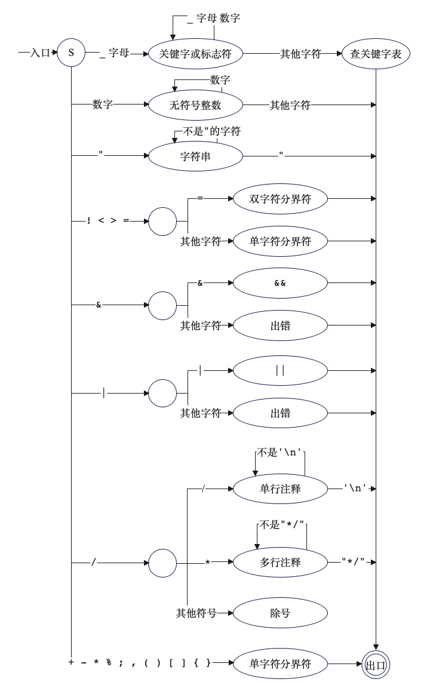

# 词法分析设计

## 词法分析综述

考虑到我对复杂的正则表达式基本不会写，所以还是用状态转移来完成词法分析吧。

## 词法分析文件结构

```
.
├── Compiler.java
├── config
│   └── Config.java
├── frontend
│   └── Lexer.java
├── token
│   ├── Token.java
│   └── TokenType.java
└── utils
    └── IOUtils.java
```

## 每个部分作用

### 从文件读入

在词法分析中，需要注意的就是文件应该怎样读取，我这里的做法是使用 `Scanner` 按行读，然后每读一行添加`\n`，全部拼接起来。这样也避免了直接读整个文件导致不同系统换行符不一致（`\r`、`\n`、`\r\n`等多种情况）的问题。

```java
public static String read(String filename) throws IOException {
    InputStream in = new BufferedInputStream(Files.newInputStream(Paths.get(filename)));
    Scanner scanner = new Scanner(in);
    StringJoiner stringJoiner = new StringJoiner("\n");
    while (scanner.hasNextLine()) {
        stringJoiner.add(scanner.nextLine());
    }
    scanner.close();
    in.close();
    return stringJoiner.toString();
}
```

> 使用 StringJoiner 可以方便的在读每一行的时候添加`\n`。

### `TokenType`

这是一个枚举。将所有的类别码全部放在这个枚举里面，方便后续词法分析的使用。

```java
public enum TokenType {
    IDENFR,
    INTCON,
    STRCON,
  	...
}
```

### `Token`

这是关键词对象。提取的每个单词的相关信息都存放在这里。

```java
public class Token {
    private TokenType type; // 类别码
    private int lineNumber; // 所在行号
    private String content; // 具体内容

    public Token(TokenType type, int lineNumber, String content) {
        this.type = type;
        this.lineNumber = lineNumber;
        this.content = content;
    }
  
    ... // Getter and setter
}
```

### `Lexer`

这是词法分析部分。

先建立一个 Map，关键词内容到类别码的映射

```java
private Map<String, TokenType> keywords = new HashMap<String, TokenType>() {{
    put("main", TokenType.MAINTK);
    put("const", TokenType.CONSTTK);
    ...
}};
```

这样的话可以很方便的使用`keywords.getOrDefault(s, TokenType.IDENFR)`来获取一个关键词的类别码。

然后重点就是 Lexer 的`analyze()`函数，在后面对其思路进行说明。

```java
public class Lexer {
    private static final Lexer instance = new Lexer();

    public static Lexer getInstance() {
        return instance;
    }

    private List<Token> tokens = new ArrayList<>();

    public List<Token> getTokens() {
        return tokens;
    }

    public void analyze(String content) {
        ... // 真正的词法分析部分
    }
  
    public String getLexAns() {
        ... // 得到词法分析的输出部分
    }
}
```

### `Config`

这里包含着一些对整个编译器的配置信息。比如当前编译器的阶段，需要输出的内容，需要进行的优化等，后续都会在这个文件里进行配置。

```java
public class Config {
    /**
     * The path of files.
     */
    public static String fileInPath = "testfile.txt";
    public static String fileOutPath = "output.txt";
    public static String stdOutPath = "stdout.txt";
    /**
     * stages of compilation
     */
    public static boolean lexer = true;

    public static void init() throws IOException {
        IOUtils.clear(fileOutPath);
        System.setOut(new PrintStream(stdOutPath));
    }
}
```

### `Compiler`

这是程序的主入口。

```java
public class Compiler {
    public static void main(String[] args) throws IOException {
        Config.init();

        Lexer.getInstance().analyze(IOUtils.read(Config.fileInPath));
        if (Config.lexer) {
            Lexer.getInstance().printLexAns();
        }
    }
}
```

## Lexer 的 analyze 的实现

我是考虑使用状态转移的方式，对整个源代码进行遍历，逐字符判断。状态图如下所示。



以判断关键词部分为例。

```java
if (c == '_' || Character.isLetter(c)) { // 标识符
    String s = "";
    for (int j = i; j < contentLength; j++) {
        char d = content.charAt(j);
        if (d == '_' || Character.isLetter(d) || Character.isDigit(d)) s += d;
        else {
            i = j - 1;
            break;
        }
    }
    tokens.add(new Token(keywords.getOrDefault(s, TokenType.IDENFR), lineNumber, s));
}
```

如果是以下划线或者字母开头，那就说明是关键词。按照上面的状态图，只需要一直读，直到不是下划线或者字母或者数字，那就说明这个关键词已经读完。创建一个 token 对象，加入 tokens 列表当中即可。其中 token 的类别码只需要使用前面 keywords 的`getOrDefault()`的方法即可获得。
