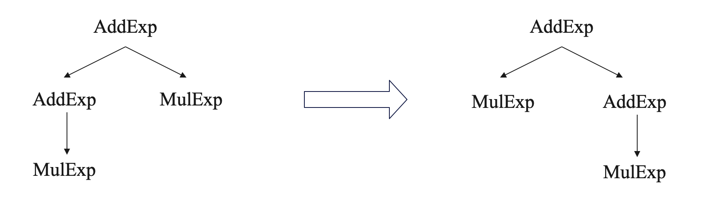

# 语法分析设计

## 语法分析综述

在前面的词法分析的基础上，考虑到实现后续功能的便捷性，我们在此处建立了一棵语法树。

当然，在使用递归下降的方法进行语法分析的要求是文法当中不存在左递归，同时尽可能的避免回溯。下面对这些情况进行考虑。

## 左递归和回溯问题

考虑到所提供的部分文法当中存在左递归，例如文法`AddExp -> MulExp | AddExp ('+' | '−') MulExp`中，我们可以将其改写成`AddExp -> MulExp | MulExp ('+' | '−') AddExp`，即可避免左递归的问题。

但是修改之后会有回溯问题，回溯问题的存在是因为对于某个非终结符号的规则其右部有多个选择，且其first集相交，从而导致分析到此语法成分时，不能仅根据当前词法成分判断接下来的语法成分是什么。我们想要避免这个回溯问题也很简单，只需要改写文法使之变成`AddExp -> MulExp [('+' | '-') AddExp]`即可解决回溯问题。

考虑到我们改写了文法，相应的语法树也会有所改变，对于语法成分输出顺序和题目中要求的会有差异。



比如上面这种情况，语法树的结构发生了改变，导致语法分析阶段输出结果的时候对于语法成分`<AddExp>`的输出存在差异，可以通过调整输出`<AddExp>`的位置来解决。

```java
public void print() {
    mulExpNode.print();
    IOUtils.write(Parser.nodeType.get(NodeType.AddExp));
    if (operator != null) {
        IOUtils.write(operator.toString());
        addExpNode.print();
    }
}
```

也就是说，把输出`<AddExp>`的句子放在每个`mulExpNode.print()`的后面即可。

## 语法分析文件结构

只展示相关的文件和文件夹。

```
.
├── Compiler.java
├── frontend
│   └── Parser.java
└── node
```

## node 文件夹

在 node 文件夹内是所有的非终结符号作为的树结点。

以文法`CompUnit -> {Decl} {FuncDef} MainFuncDef`为例。

```java
public class CompUnitNode {
    // CompUnit -> {Decl} {FuncDef} MainFuncDef

    private List<DeclNode> declNodes;
    private List<FuncDefNode> funcDefNodes;
    private MainFuncDefNode mainFuncDefNode;

    public CompUnitNode( ... ) {
        ...
    }

    public void print() {
        for (DeclNode declNode : declNodes) {
            declNode.print();
        }
        for (FuncDefNode funcDefNode : funcDefNodes) {
            funcDefNode.print();
        }
        mainFuncDefNode.print();
        IOUtils.write(Parser.nodeType.get(NodeType.CompUnit));
    }

}
```

`{Decl}`表示`Decl`有可能有零个到多个，我们选择使用`List<DeclNode>`来存储所有的 Decl 的树结点。类似的使用`List<FuncDefNode>`来存储所有的 FuncDefNode 的树结点。

## `Parser`

文件结构如下所示。

```java
public class Parser {
    private static final Parser instance = new Parser();

    public static Parser getInstance() {
        return instance;
    }

    private List<Token> tokens;
    private int index = 0;
    private Token now;
    private CompUnitNode compUnitNode;

    public void setTokens(List<Token> tokens) {
        ...
    }

    public CompUnitNode getCompUnitNode() {
        return compUnitNode;
    }

    public void analyze() {
        this.compUnitNode = CompUnit();
    }

    public static Map<NodeType, String> nodeType = new HashMap<NodeType, String>() {{
        put(NodeType.CompUnit, "<CompUnit>\n");
        put(NodeType.Decl, "<Decl>\n");
        ...
    }}

    ... // 对每条文法进行分析
      
    private Token match(TokenType tokenType) {
        if (now.getType() == tokenType) {
            Token tmpNow = now;
            if (index < tokens.size() - 1) {
                now = tokens.get(++index);
            }
            return tmpNow;
        } else {
            throw new RuntimeException("Syntax error at line " + now.getLineNumber() + ": " + now.getContent() + " is not " + tokenType);
        }
    }

    public void printParseAns() {
        // 输出语法分析部分答案
        compUnitNode.print();
    }
}
```

`Map<NodeType, String> nodeType`的作用是将要输出的语法成分的名字放在一个 Map 里面，直接使用`nodeType.get()`方法可以方便的进行输出。同时如果以后需要修改输出的语法成分的名字等，也只需要修改这一个地方即可完成。

`Token match(TokenType tokenType)`是判断当前 tokens 列表当中下标为 index 的元素的 type 是否与所期望的 tokenType 相同。如果相同则表示这个语法成分是正确的，否则就给出 RuntimeException，同时输出相关错误信息。

`printParseAns()`即为输出语法分析阶段答案的方法，通过遍历语法树的方式进行答案的输出。

### Stmt 文法

```
Stmt -> LVal '=' Exp ';'
	| [Exp] ';'
	| Block
	| 'if' '(' Cond ')' Stmt [ 'else' Stmt ] 
	| 'while' '(' Cond ')' Stmt
	| 'break' ';' | 'continue' ';'
	| 'return' [Exp] ';'
	| LVal '=' 'getint' '(' ')' ';'
	| 'printf' '(' FormatString { ',' Exp } ')' ';'
```

在 Parser.java 当中，对 Stmt 文法处理的流程图如下所示。


Stmt 文法处理代码结构如下所示。

```java
private StmtNode Stmt() {
    if (tokens.get(index).getType() == TokenType.LBRACE) {
        // Block
        ...
        return new StmtNode( ... );
    } else if (tokens.get(index).getType() == TokenType.PRINTFTK) {
        // 'printf' '(' FormatString { ',' Exp } ')' ';'
        ...
        return new StmtNode( ... );
    } else if (tokens.get(index).getType() == TokenType.IFTK) {
        // 'if' '(' Cond ')' Stmt [ 'else' Stmt ]
        ...
        return new StmtNode( ... );
    } else if (tokens.get(index).getType() == TokenType.WHILETK) {
        // 'while' '(' Cond ')' Stmt
        ...
        return new StmtNode( ... );
    } else if (tokens.get(index).getType() == TokenType.BREAKTK) {
        // 'break' ';'
        ...
        return new StmtNode( ... );
    } else if (tokens.get(index).getType() == TokenType.CONTINUETK) {
        // 'continue' ';'
        ...
        return new StmtNode( ... );
    } else if (tokens.get(index).getType() == TokenType.RETURNTK) {
        // 'return' [Exp] ';'
        ...
        return new StmtNode( ... );
    } else {
        ... // 计算 assign
        if (assign > index) {
            ...
            if (tokens.get(index).getType() == TokenType.GETINTTK) {
                // LVal '=' 'getint' '(' ')' ';'
                ... 
                return new StmtNode( ... );
            } else {
                // LVal '=' Exp ';'
                ... 
                return new StmtNode( ... );
            }
        } else {
            // [Exp] ';'
            ...
            return new StmtNode( ... );
        }
    }
}
```
